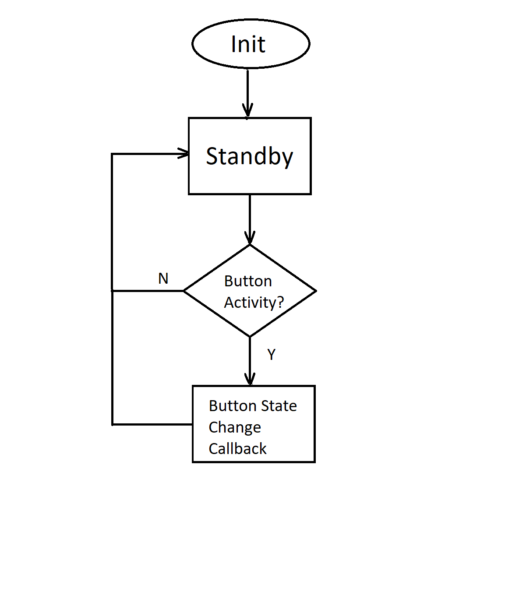

# Bluetooth&reg; LE Button Utility

## Overview
This utility provides user button driver functions.

## Requirements
The led_lib_init() function with proper parameter must be called first before any other functions can be called in this utility.
Two parameters shall be provided at initialization; the button count, and array of button configurations.

## Detailed Design and Review

## Repo staging
